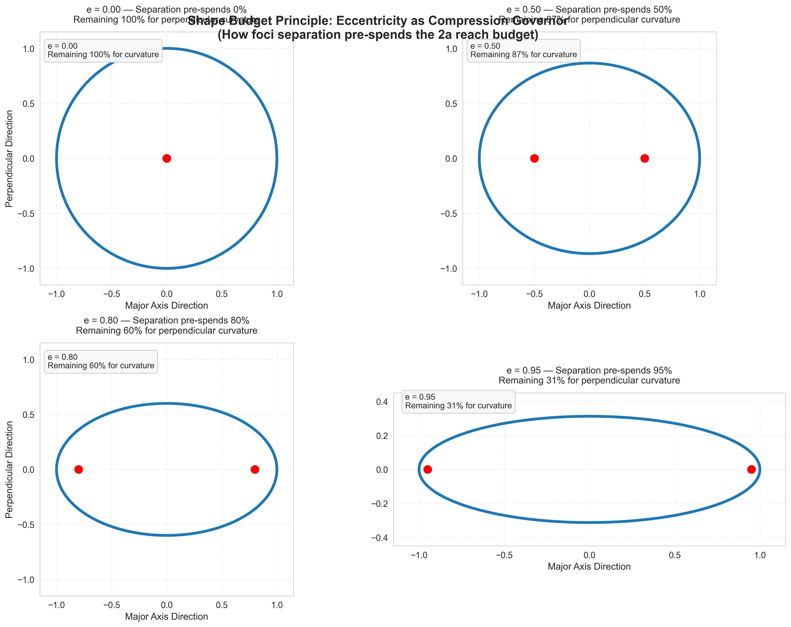
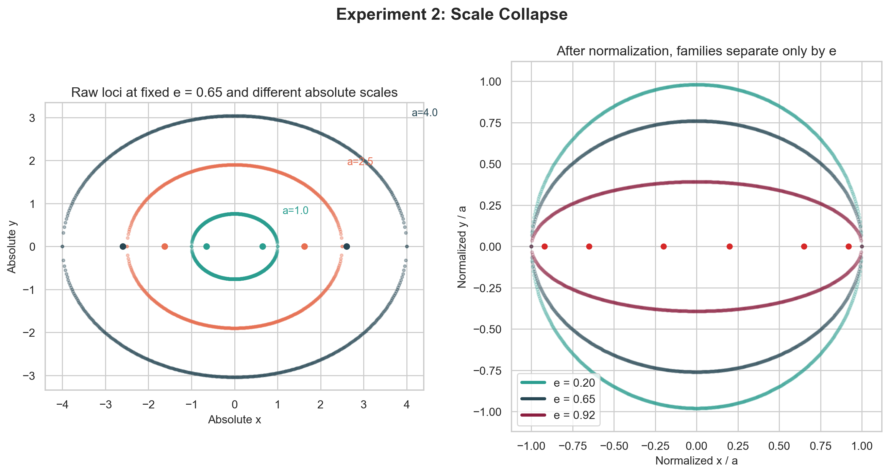

# Shape Budget

The Budget Governor Principle (BGP) is the latent control parameter `e = c / a` for the symmetric constant-sum two-source process.

In that regime, `e` governs the normalized shape family, predicts normalized observables, and is recoverable from boundary data. This repository establishes that base case, extends the same budget logic into asymmetry, anisotropy, and multi-source control objects, and isolates the current open inverse bottleneck in the pose-free anisotropic setting.

**BGP in one sentence:** normalized separation relative to total budget governs how much transverse freedom remains after structural separation cost is paid.

The project name is **Shape Budget**. The scientific claim developed here is the **Budget Governor Principle**.

## The Base Case

Start with two offset sources that share a fixed total reach budget.

Some of that budget is consumed by the separation itself. The remainder shows up as width, spread, and curvature in the final shape.

In the symmetric two-source ellipse case, the key ratio is:

```text
e = separation / total budget
```

More precisely, if the focal half-separation is `c` and the semimajor axis is `a`, then:

```text
e = c / a
```

and the remaining normalized transverse spread is:

```text
b / a = sqrt(1 - e^2)
```

So the core scientific question in this repo is not only:

- “what shape is this?”

but also:

- “how much of the available budget was already committed before the shape had room to spread?”

## The Mathematical Base Case

The clean mathematical base case is the constant-sum two-source Euclidean process:

```text
|x - F1| + |x - F2| = 2a
```

In this repo’s terminology:

- `e = c / a` is the **allocation readout**
- `b / a = sqrt(1 - e^2)` is the **transverse residue**

That is the first form of the Budget Governor Principle:

> under the symmetric constant-sum two-source process, one normalized ratio governs the whole normalized shape family.

The experiments in this repo then test:

1. Is that ratio really a control variable, or just a renamed parameter?
2. Does it stay useful when we add asymmetry, more sources, or anisotropy?
3. Can the hidden control object be recovered from boundary data?
4. Where does that recovery fail, and why?

## Key Plot 1: Compression Under Fixed Total Budget



This figure shows the base mechanism.

Each panel keeps the same total budget while changing only the normalized source separation. As `e` increases, more of the total budget is effectively pre-committed to bridging the gap between the two sources. The visible effect is not random: the family gets systematically narrower and more elongated.

The figure shows that eccentricity tracks a structural budget split, not just a finished-shape label. The shape is the residue after the separation tax is paid.

## Key Plot 2: Same Governor, Same Normalized Shape



This figure is the first serious hardening test of the control-parameter claim.

On the left, the same normalized separation ratio is realized at different absolute scales. On the right, after normalization, those shapes collapse onto each other almost exactly. That is the experimental basis for the claim that `e = c / a` is the governing control knob in the symmetric two-source case.

In other words:

- change the absolute size, keep the ratio fixed, and the normalized shape stays the same
- change the ratio, and the normalized family moves

That is the core one-knob result in this repo.

## What The Experiments Found

The project now establishes a broader result set than the original concept note alone.

### 1. In the symmetric two-source case, the control knob is real

The main control-knob experiment showed:

- the circle-combination process reconstructs the analytic ellipse to machine precision
- fixed `e` gives normalized scale collapse
- several normalized observables behave as one-dimensional functions of `e`

The known-source inverse experiment then showed that `e` is also operational:

- it can be recovered accurately from noisy, partial, and sparse boundary observations
- it strongly outperforms raw separation `d`, raw budget `S`, or low-capacity models on `(d, S)` under scale shift

### 2. The claim broadens in a structured way

Once symmetry is broken, the original one-knob family does **not** survive unchanged.

That is a good thing, not a bad one, because the failure is structured:

- asymmetry upgrades the family from one control variable to two
- the fixed-difference twin yields a hyperbola-side counterpart
- controlled anisotropy upgrades the raw family to `(e, alpha)`
- three-source families are governed by compact normalized source-placement objects rather than by one scalar

So the current view is not:

- “everything is one knob forever”

It is:

- “budget-governed shape families stay low-dimensional, but the right control object expands as the process gets richer”

## Key Plot 3: From Shape Description To Latent Variable


This is one of the most important transitions in the repo.

By this point the project is no longer only saying that certain shape families can be *described* by compact normalized variables. It is showing that those hidden variables can be *recovered* from the boundary.

In the weighted three-source case, the important hidden object is:

- normalized source placement relative to budget
- plus normalized source participation weights

The inverse experiments show that this compact control object is recoverable from boundary-only data and clearly outperforms simpler baselines that ignore the weight degrees of freedom.

That is why the project increasingly talks about **operational latent variables** rather than just geometric descriptors.

### 3. The current bottleneck is not “the idea breaks”

The hardest branch so far is the pose-free anisotropic inverse:

- unknown rotation
- unknown anisotropy
- unknown geometry
- unknown participation weights

What the repo found is surprisingly specific:

- geometry stays fairly recoverable
- weights degrade, but remain usable
- anisotropy `alpha` becomes the weakly identified direction

That means the failure is selective, not uniform.

The current diagnosis is that this is mainly a **symmetry-handling** problem: hidden rotation can impersonate medium anisotropy much more easily than it can impersonate the underlying normalized geometry.

## Key Plot 4: The Signal Is There, But Pose Handling Matters


This figure shows one of the most important diagnostics in the whole folder.

The baseline pose-free anisotropic inverse does not recover `alpha` well. But when the inverse is given the true pose, `alpha` error drops dramatically across every tested regime. That means the anisotropy signal is genuinely present in the boundary; the current pipeline is mostly losing it because practical pose handling is unstable under incomplete observations.

This is why the repo’s current bottleneck is no longer “is there really a latent variable here?” It is “how do we preserve enough broken symmetry before inference starts?”

## Key Plot 5: Where The Current Pipeline Fails


This map is the current state of the art for the hardest branch.

It shows that practical pose handling does not fail everywhere equally. The bad regions are structured:

- sparse or partial observations are much harder than full observations
- low-skew and especially mid-skew source geometries are harder than high-skew ones
- moderate and strong anisotropy are harder than weak anisotropy

That matters because it turns a vague problem into a targetable one. The next method does not need to be globally clever in an abstract way. It needs to be better in these specific failure cells.

## Where To Start Reading

If you want the shortest path through the project:

1. Read the original idea in [CONCEPT.md](experiments/concept.md).
2. Read the mathematical cleanup in [DERIVATION.md](experiments/derivation.md).
3. Read the higher-level synthesis in [technical_note.md](technical-note/technical_note.md).

If you want the strongest evidence path:

1. [CONTROL_KNOB_EXPERIMENT.md](experiments/core-control-knob/control-knob/README.md)
2. [IDENTIFIABILITY_AND_BASELINES.md](experiments/core-control-knob/identifiability-and-baselines/README.md)
3. [ASYMMETRY_EXPERIMENT.md](experiments/two-source-extensions/asymmetry/README.md)
4. [WEIGHTED_MULTISOURCE_INVERSE_EXPERIMENT.md](experiments/multisource-control-objects/weighted-multisource-inverse/README.md)
5. [WEIGHTED_ANISOTROPIC_INVERSE_EXPERIMENT.md](experiments/multisource-control-objects/weighted-anisotropic-inverse/README.md)
6. [ORACLE_ALIGNMENT_CEILING_EXPERIMENT.md](experiments/pose-anisotropy-diagnostics/oracle-alignment-ceiling/README.md)
7. [ALIGNMENT_FAILURE_MAP_EXPERIMENT.md](experiments/pose-anisotropy-diagnostics/alignment-failure-map/README.md)

If you want the full research trajectory, see [RESEARCH_ROADMAP.md](experiments/research-roadmap.md).

## Repo Tour

### Core idea and synthesis

- [experiments/CONCEPT.md](experiments/concept.md)
- [experiments/DERIVATION.md](experiments/derivation.md)
- [technical-note/technical_note.md](technical-note/technical_note.md)

### Experiment notes

- [experiments/CONTROL_KNOB_EXPERIMENT.md](experiments/core-control-knob/control-knob/README.md)
- [experiments/IDENTIFIABILITY_AND_BASELINES.md](experiments/core-control-knob/identifiability-and-baselines/README.md)
- [experiments/ASYMMETRY_EXPERIMENT.md](experiments/two-source-extensions/asymmetry/README.md)
- [experiments/MULTISOURCE_EXPERIMENT.md](experiments/multisource-control-objects/multisource/README.md)
- [experiments/WEIGHTED_MULTISOURCE_INVERSE_EXPERIMENT.md](experiments/multisource-control-objects/weighted-multisource-inverse/README.md)
- [experiments/WEIGHTED_ANISOTROPIC_INVERSE_EXPERIMENT.md](experiments/multisource-control-objects/weighted-anisotropic-inverse/README.md)
- [experiments/POSE_FREE_WEIGHTED_ANISOTROPIC_INVERSE_EXPERIMENT.md](experiments/multisource-control-objects/pose-free-weighted-anisotropic-inverse/README.md)
- [experiments/ORACLE_ALIGNMENT_CEILING_EXPERIMENT.md](experiments/pose-anisotropy-diagnostics/oracle-alignment-ceiling/README.md)
- [experiments/ALIGNMENT_FAILURE_MAP_EXPERIMENT.md](experiments/pose-anisotropy-diagnostics/alignment-failure-map/README.md)

### Scripts and plots

- [generate_shape_budget_plots.py](generate_shape_budget_plots.py)
- [generate_brainstorm_shape_budget_visuals.py](generate_brainstorm_shape_budget_visuals.py)
- [plots](plots)
- [experiments](experiments/README.md)

## Reproducing The Main Artifacts

At the top level:

```bash
python3 generate_shape_budget_plots.py
python3 generate_brainstorm_shape_budget_visuals.py
```

For the deeper experiment suite, each experiment lives in its own folder with a `README.md`, a `run.py`, and an `outputs/` directory. For example:

```bash
python3 experiments/core-control-knob/control-knob/run.py
python3 experiments/core-control-knob/identifiability-and-baselines/run.py
python3 experiments/pose-anisotropy-diagnostics/alignment-failure-map/run.py
```

To build the technical note PDF:

```bash
cd technical-note
./build_pdf.sh
```

## Current Status

The repo now establishes the Budget Governor Principle:

- in the symmetric two-source Euclidean case, one normalized ratio really does govern normalized geometry
- in richer cases, that same budget logic expands into compact low-dimensional control objects
- in weighted inverse settings, those control objects are operational latent variables
- the main unresolved technical problem is robust symmetry handling in the pose-free anisotropic branch

The repository establishes BGP as a framework for budget-governed geometry and for how much of its hidden structure can be recovered from observation.
