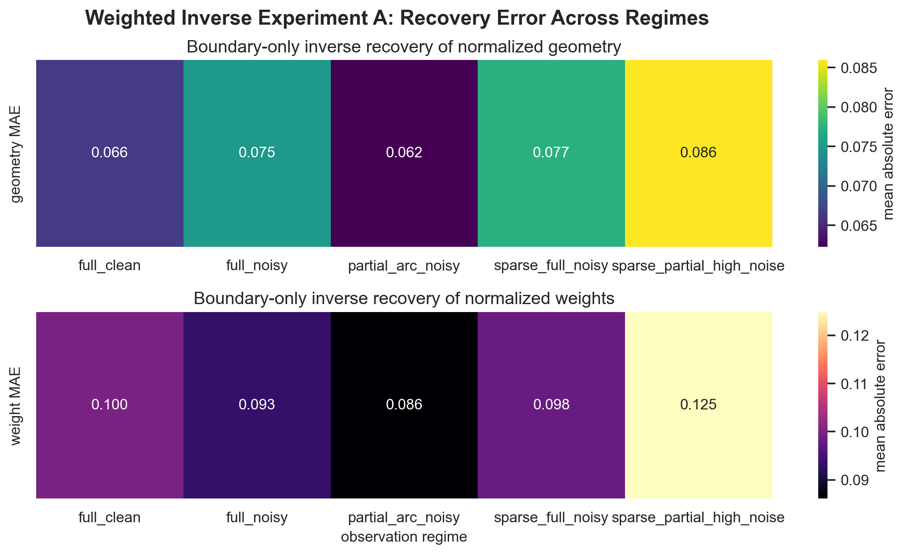
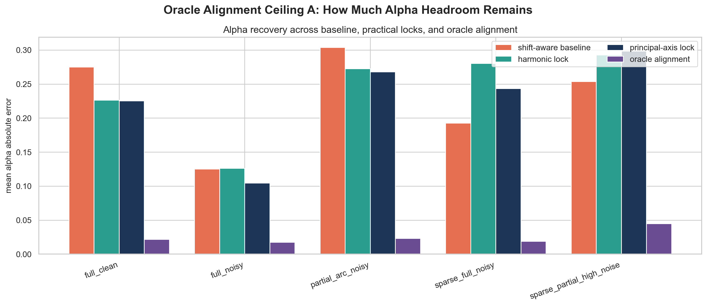
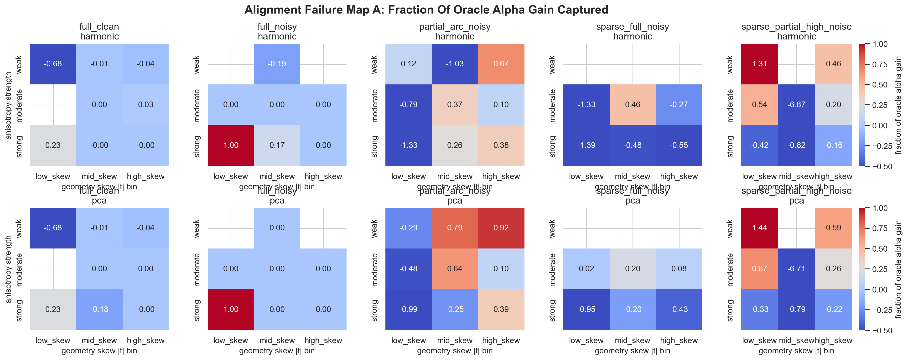

**Keywords:** ellipse eccentricity; conic geometry; inverse problems; latent variables; anisotropy; multi-source geometry; scale collapse; shape analysis

# Opening Statement

This note asks a specific question: is the Budget Governor Principle only a useful reinterpretation of ellipse geometry, or does it define a real organizing and inferential principle for budget-constrained multi-source shape families?

The repository now supports a stronger answer than the original concept note could support on its own [@shapebudget2026]. The current evidence does not say that all geometry reduces to one scalar, and it does not say that the initial ellipse framing was already a finished theory. What it does say is more interesting: in the symmetric two-source case there is a genuine one-knob normalized control law, and beyond that case the same budget logic appears to lift into compact low-dimensional control objects that can be recovered from boundary data.

That shift matters. It moves BGP from a descriptive reframing toward an operational latent-variable program.

# Core Proposal

The narrowest version of BGP is the symmetric constant-sum two-source Euclidean process:

$$
\|x-F_1\| + \|x-F_2\| = 2a
$$

with focal half-separation `c`. In that setting, the proposed governor variable is

$$
e = \frac{c}{a},
$$

read not merely as eccentricity after the fact, but as a normalized separation load. The corresponding transverse residue is

$$
\frac{b}{a} = \sqrt{1-e^2}.
$$

The core BGP reading is therefore:

> normalized source separation relative to total budget governs how much geometric freedom remains after structural separation cost is paid.

In the symmetric ellipse case, that control object collapses to one scalar. In richer settings, the scalar does not survive unchanged, but the underlying budget logic may still survive in the form of compact control manifolds built from normalized placement, participation, and medium structure.

# Why The Proposal Is Nontrivial

If this were only a new way to paraphrase the ellipse equation, it would not justify a technical note of this scope.

The nontrivial part is narrower and stronger:

1. the symmetric ratio `e = c/a` behaves like a sufficient organizing variable for normalized geometry rather than just a passive descriptor,
2. that variable is operational in recovery and prediction, not just available in closed form,
3. once symmetry is broken or the source family expands, the collapse does not dissolve chaotically but upgrades to low-dimensional control objects,
4. and in weighted multi-source settings those compact objects can be inferred from boundary data.

The project is therefore no longer only about ellipse interpretation. It is about whether budget-normalized latent structure governs shape families in a reusable way.

# Mathematical Core: The Symmetric Control Knob

The foundation experiment in this repository tests the strongest mathematical heart of the idea:

- process reconstruction from the constant-sum two-circle construction,
- scale collapse at fixed `e`,
- one-dimensional response curves for normalized observables,
- and a full separation-budget phase map.

The result is clean. Across the sweep:

- maximum ellipse-equation residual was `1.5876e-14`,
- maximum pairwise scale-collapse error after normalization was `3.9736e-08`,
- and normalized width, perimeter, and tip-response observables behaved as functions of `e` alone within numerical tolerance.

{ width=92% }

This is the narrowest claim the repository now supports:

> under the symmetric constant-sum two-source Euclidean process, `e = c/a` behaves like a sufficient control variable for normalized geometry.

That statement is strong enough to matter and narrow enough to stay honest.

# Operational Evidence in the Symmetric Setting

The next question is whether the control knob is useful, not only elegant.

The known-source inverse experiment shows that `e` is recoverable from noisy, partial, and sparse boundary observations with high accuracy. Mean absolute recovery error ranged from `1.46e-4` in the easiest setting to `3.46e-3` in the harshest tested setting, and even the worst 95th-percentile error remained about `1.26e-2`.

The same study also compared `e` against raw alternatives under a scale-held-out prediction split. For normalized perimeter, for example, test RMSE was `1.90e-4` using `e` alone, versus `5.59e-1` for a low-capacity model on `(d, S)`, `3.64` for raw `d`, and `5.65` for raw `S`.

{ width=92% }

This is where the project first crossed from reframing into operational evidence.

The edge-regime study sharpened that result further. Near `e = 0`, several shape summaries are first-order flat, so low-depletion systems are intrinsically hard to distinguish from shape alone. Near `e = 1`, width and major-tip response become much sharper probes than perimeter. The measured crossover points were:

- `e = 0.57735` for major-tip response,
- `e = 0.70711` for width,
- `e = 0.90891` for perimeter.

So in the symmetric setting, the budget ratio appears to govern not only the shape family but also which probes are most useful for inverse recovery.

# Structured Generalization Beyond One Knob

The next stage of the work asked whether the story survives outside the exact symmetric ellipse case.

The first asymmetry pilot replaced the symmetric budget rule with a weighted split and found a clean structured upgrade:

- one-knob sufficiency fails under asymmetry,
- but a two-parameter family `(e, w)` collapses cleanly across scale,
- with maximum two-knob collapse error `3.7196e-08`.

{ width=92% }

This is exactly the kind of result one wants if the principle is tracking real process structure rather than merely renaming a special-case formula.

The nearby extensions also stayed structured:

- the fixed-difference twin produced a hyperbola family with one-knob collapse under `lambda = a/c`,
- controlled quadratic anisotropy upgraded the raw family to `(e, alpha)` and whitening restored the original one-knob collapse,
- the equal-weight three-source case was organized by the normalized source triangle relative to budget and remained strongly low-dimensional,
- and the weighted three-source case was organized by the normalized source triangle plus the weight simplex, with the broad family behaving like a low-dimensional roughly five-parameter manifold.

The important point is that the principle did not survive as “still one scalar everywhere.” It survived as a low-dimensional allocation geometry.

# From Descriptor To Operational Latent Variable

The most important shift in the repository is inferential, not geometric.

In the weighted three-source canonical-pose inverse, a simple boundary-only reference-bank inverse recovered the normalized source triangle and normalized weights with useful accuracy:

- mean geometry MAE ranged from `0.062` to `0.086`,
- mean weight MAE ranged from `0.086` to `0.125`,
- and the weighted inverse beat an equal-weight baseline by about `1.88x` to `5.53x` depending on regime.

{ width=92% }

That is the point where the project stopped being only about how to describe shape and became about what hidden state can be inferred from it.

The controlled anisotropic extension strengthened that reading further. In the canonical-pose weighted anisotropic inverse:

- geometry MAE stayed around `0.077` to `0.089`,
- weight MAE stayed around `0.081` to `0.133`,
- mean `alpha` error stayed around `0.018` to `0.064`,
- and the anisotropy-aware inverse beat the Euclidean weighted shortcut by about `7.6x` to `14.0x`.

That is strong evidence that medium structure can join geometry and participation as part of the same operational latent object.

# Pose-Free Anisotropy and the Current Bottleneck

The hardest current branch is the pose-free anisotropic inverse, where unknown rotation and unknown medium anisotropy appear together.

In that combined-nuisance setting, the latent object remains operational but unevenly so:

- geometry MAE stayed around `0.071` to `0.104`,
- weight MAE stayed around `0.138` to `0.166`,
- but mean `alpha` error rose to about `0.146` to `0.304`.

This is not a uniform collapse of the inverse. It is a selective weakness along the anisotropy direction.

The matched ambiguity study made that diagnosis much sharper. Hiding rotation broadened the top-`10` `alpha` envelope by about `3.7x` to `5.6x` and worsened best-`alpha` error by about `11.4x` to `31.0x`, while geometry dispersion stayed essentially unchanged.

The oracle alignment ceiling then showed that the missing signal is largely still there. Giving the inverse the true pose improved `alpha` by about `5.65x` to `13.21x` across all regimes while leaving geometry roughly stable.

{ width=92% }

The newest failure-map result puts a shape on that bottleneck:

- full observations are the only region where simple practical locking stays broadly non-negative on oracle-gain capture,
- high-skew geometries are friendlier than low-skew and mid-skew ones,
- weak anisotropy is easier than moderate or strong anisotropy,
- and the main failure zones are sparse or partial observations with low-to-mid geometry skew.

{ width=92% }

The current pose-free anisotropy story is therefore not “BGP breaks.” It is “the latent structure survives, but one latent direction is selectively masked by leftover symmetry before inference begins.”

# What The Current Evidence Supports

At the current stage of the project, the following claims appear supportable.

1. In the symmetric constant-sum two-source Euclidean process, `e = c/a` behaves like a sufficient control variable for normalized geometry, and `b/a = sqrt(1-e^2)` is the corresponding transverse residue.
2. In that same symmetric known-source setting, `e` is operational: it is recoverable from noisy boundary observations and strongly outperforms raw separation and raw budget variables under scale shift.
3. Beyond the symmetric ellipse case, the budget-governor story survives in a structured way. Asymmetry upgrades the family from one knob to two, controlled anisotropy adds a medium parameter, and three-source families are governed by compact normalized control objects rather than by one scalar.
4. In weighted multi-source settings, normalized geometry plus normalized participation behaves like an operational latent variable recoverable from boundary data.
5. In controlled anisotropic settings, medium structure can join that latent variable, and most of the current pose-free anisotropy penalty appears to be a symmetry-handling problem rather than an absence-of-signal problem.

That is already a much larger claim package than the original concept note.

# Limits And Scope

This note is still narrower than a finished general theory.

The current evidence is based on controlled computational studies. The strongest exact mathematical statement remains the symmetric two-source Euclidean core. Most of the richer claims are empirical structural claims supported by numerical experiments rather than formal proofs.

The inverse results are also intentionally structured:

- finite reference banks rather than full continuous optimizers,
- radial-signature encodings rather than arbitrary boundary representations,
- controlled anisotropy rather than arbitrary warped media,
- and mostly three-source families rather than unrestricted source count.

The repository does not yet establish:

- universal sufficiency of one scalar beyond the symmetric ellipse case,
- recovery under arbitrary anisotropy-axis orientation,
- full robustness under richer non-quadratic or spatially varying media,
- or a final practical pose-equivariant inverse that closes the current anisotropy gap in sparse partial regimes.

Those are real open problems, not wording details.

# Practical Interpretation

The practical use of BGP is not “always compute eccentricity.”

The practical use is:

- identify the compact normalized budget variables that govern a family,
- use them as the primary state for prediction and comparison,
- and in inverse settings, ask whether the observed boundary is sufficient to recover that hidden budget object.

In the symmetric two-source case, that means `e` is a real control coordinate and even tells you which probes are worth trusting at different depletion phases.

In the richer multi-source and anisotropic families, the same logic becomes:

- normalized placement,
- normalized participation,
- and sometimes medium structure

are better state variables than raw distances, raw scale, or unstructured shape summaries.

The main practical engineering lesson from the current phase is just as important:

> when one part of the hidden budget state becomes weakly identifiable, the right next move may be better symmetry handling rather than a larger bank or a more complicated regressor.

# Next Revision Targets

The strongest next steps are:

1. build robust pose handling specifically for the sparse or partial low-to-mid-skew cells identified by the failure map,
2. run the planned probe-specialization experiment so the edge-regime conditioning results become a full inverse-design result rather than only a conditioning note,
3. test whether richer pose-equivariant or hybrid alignment methods can close a substantial fraction of the current oracle headroom,
4. extend the medium branch beyond a single axis-aligned anisotropy parameter,
5. and begin out-of-family application tests that use BGP as an inferential control object rather than only a geometric story.

# Conclusion

The Shape Budget project began as a fresh reading of ellipse eccentricity. It is now something more substantial.

The narrow mathematical heart is still the symmetric two-source result: `e = c/a` acts like a budget governor for normalized geometry. But the repository now supports a broader and more interesting picture. The same budget logic appears to extend into low-dimensional control objects for asymmetric, anisotropic, and multi-source families, and in weighted inverse settings those objects behave like operational latent variables rather than descriptive conveniences.

The current bottleneck is also clearer than it was at the start. The hardest remaining problem is not whether the latent state exists. It is how to keep enough symmetry broken before inference to recover the anisotropy part of that latent state robustly under sparse and partial observations.

That is a strong place for the program to be. It means BGP is no longer only an idea about what shapes mean. It is becoming a technical framework for how budget-constrained geometry is organized and how much of that hidden organization can be recovered from what we observe.

# Artifact References

- [Concept note](../concepts/shape-budget/CONCEPT.md)
- [Derivation note](../concepts/shape-budget/DERIVATION.md)
- [Control-knob experiment](../concepts/shape-budget/CONTROL_KNOB_EXPERIMENT.md)
- [Identifiability and baselines](../concepts/shape-budget/IDENTIFIABILITY_AND_BASELINES.md)
- [Asymmetry experiment](../concepts/shape-budget/ASYMMETRY_EXPERIMENT.md)
- [Multi-source experiment](../concepts/shape-budget/MULTISOURCE_EXPERIMENT.md)
- [Weighted multi-source inverse](../concepts/shape-budget/WEIGHTED_MULTISOURCE_INVERSE_EXPERIMENT.md)
- [Weighted anisotropic inverse](../concepts/shape-budget/WEIGHTED_ANISOTROPIC_INVERSE_EXPERIMENT.md)
- [Pose-free weighted anisotropic inverse](../concepts/shape-budget/POSE_FREE_WEIGHTED_ANISOTROPIC_INVERSE_EXPERIMENT.md)
- [Latent ambiguity experiment](../concepts/shape-budget/LATENT_AMBIGUITY_EXPERIMENT.md)
- [Oracle alignment ceiling](../concepts/shape-budget/ORACLE_ALIGNMENT_CEILING_EXPERIMENT.md)
- [Alignment failure map](../concepts/shape-budget/ALIGNMENT_FAILURE_MAP_EXPERIMENT.md)
- [Research roadmap](../concepts/shape-budget/RESEARCH_ROADMAP.md)
